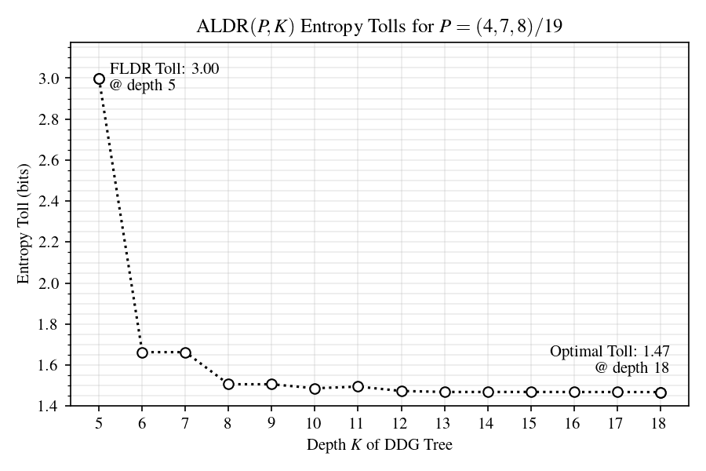
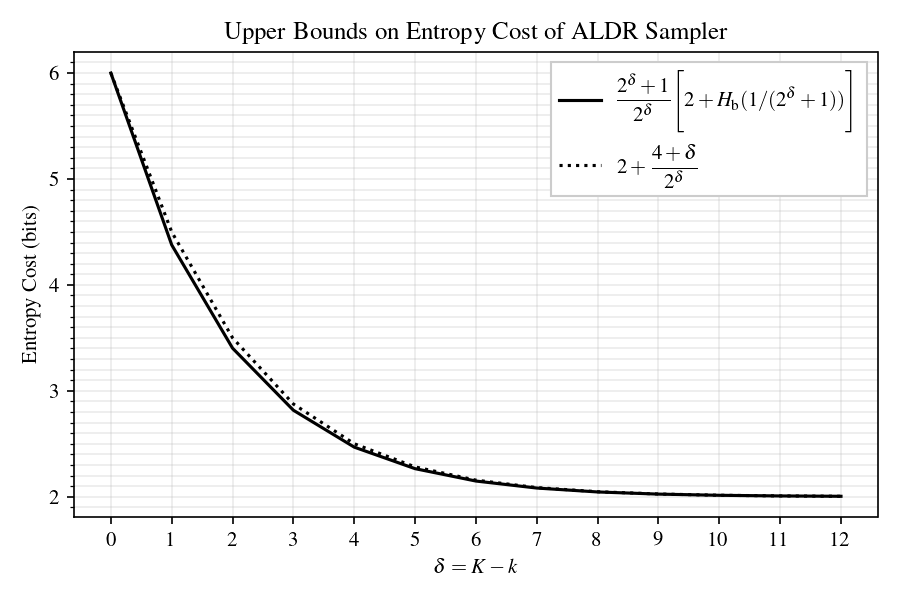
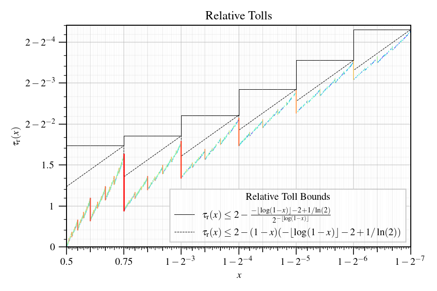
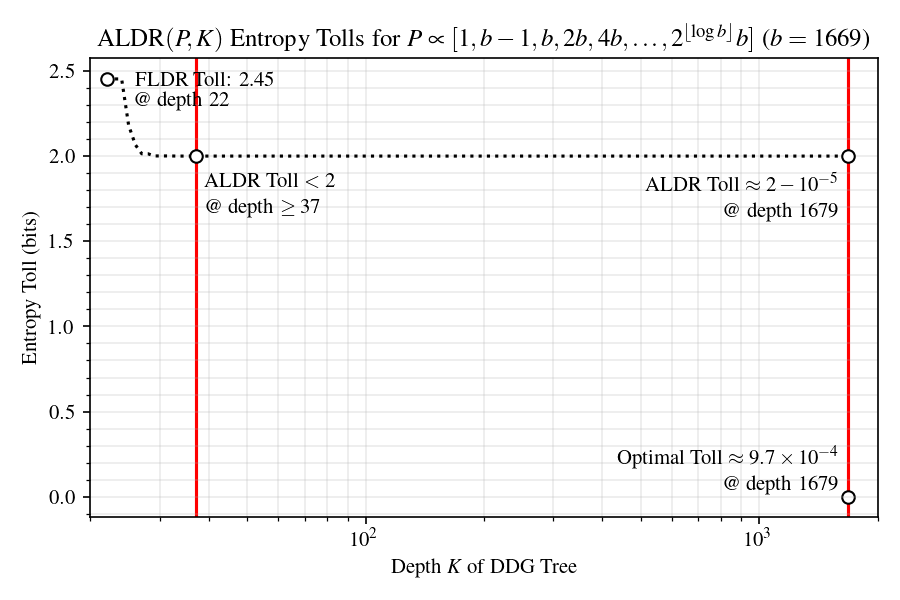
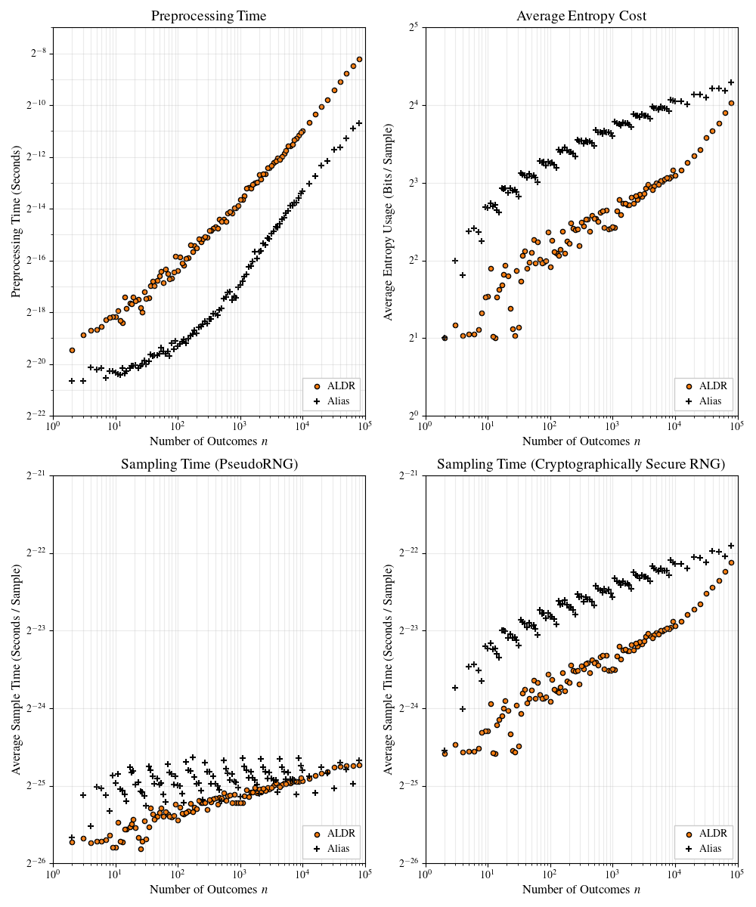

# The Amplified Loaded Dice Roller -- Experiments

This repository contains experiments relating to the
Amplified Loaded Dice Roller (ALDR), a fast algorithm for generating
rolls of an $n$-sided die with rational probabilities.

For a reference implementation of ALDR in C, please use the
stand-alone repository in
[https://github.com/probsys/amplified-loaded-dice-roller](https://github.com/probsys/amplified-loaded-dice-roller).

## Installation

Please use a Python 3 virtual environment.
To install the required Python modules, run the following.

```sh
pip install -r requirements.txt
```

The `c/` and `rust/` directories include benchmarking programs
for ALDR and the exact alias method, which read distributions
from `distributions/*.dist`.
To build these benchmarks, follow the instructions in
[c/README.md](c/README.md) and
[rust/aldr/README.md](rust/aldr/README.md).

## Running the experiments

The following instructions show how to reproduce
Figures 4, 5, 6, 8, and 11 from the main paper,
as well as other related computations.
This software is tested on Ubuntu 24.04.

### Figure 4



Run the notebook in
[python/figure-4-aldr-tree-tolls-478.ipynb](python/figure-4-aldr-tree-tolls-478.ipynb).

### Figure 5



Run the notebook in
[python/figure-5-aldr-generic-toll-bound.ipynb](python/figure-5-aldr-generic-toll-bound.ipynb).

### Figure 6



Run the notebook in
[python/figure-6-relative-tolls.ipynb](python/figure-6-relative-tolls.ipynb).

### Figure 8



Run the notebook in
[python/figure-8-aldr-tolls-1669.ipynb](python/figure-8-aldr-tolls-1669.ipynb).

### Figure 11



Run the notebook in
[python/figure-11-alias-aldr-compare.ipynb](python/figure-11-alias-aldr-compare.ipynb).

### More experiments

More complete benchmarking data is included in
[python/aldr-alias-performance-data.txt](python/aldr-alias-performance-data.txt).
To collect this data for your system, make sure that the
`c/` and `rust/aldr/` projects are built, and then run
[python/experiment-benchmark.py](python/experiment-benchmark.py).
The notebook
[python/experiment-benchmark.ipynb](python/experiment-benchmark.ipynb)
contains more visualizations
for these data compared to
[python/figure-11-alias-aldr-compare.ipynb](python/figure-11-alias-aldr-compare.ipynb).

The notebooks `python/experiment-*.ipynb` contain more experiments
and examples of ALDR trees, as well as analysis of the entropy cost.

### Entropy cost bounds

The script
[python/verification-toll-aldr-p-2k-leq-2.py](python/verification-toll-aldr-p-2k-leq-2.py)
provides a concise verification that the toll of ALDR
is less than $2$ at depths satisfying $2k \leq K < 16$,
which completes the computational part of the proof of
Theorem (Bounding the toll of ALDR) in the paper.
The following scripts give further computational
confirmation of the Theorem:

1. `python/bruteforce-max-toll.py`:
a brute-force search over integer partitions of $m$
(in exponential time),
1. `python/dp-*.py`:
an array dynamic programming algorithm to
compute the worst-case toll of any $m$-type distribution
(in quadratic time),
1. `python/relative-toll-*.py`:
a linear check of the stronger bound that the
relative toll of each $A_i$ given weight sum $M$
is less than two for each $a_i \in \{ 1, \ldots, m \}$.

### Experimental Python library

The file [python/customtree.py](python/customtree.py)
contains an implementation of the Knuth and Yao
entropy-optimal tree for finite rational discrete distributions,
as well as FLDR and ALDR with related functions for entropy cost.
The file [python/customtreeplot.py](python/customtreeplot.py)
contains automatic plotting functions for tolls of ALDR trees
as a function of depth.
